# react-native-ios-context-menu

<br>

## 🚧⚠️ **Library WIP** ⚠️🚧

- The documentation is incomplete (some parts/sections are marked as **TBA** i.e. "to be added"). 
- Some of the links in the documentation are broken (i.e. the URL points to `PLACE_HOLDER_LINK`).

<br><br>

## A. Introduction

<br><br>

## B. Installation

```sh
# install via NPM
npm install react-native-ios-context-menu

# or install via yarn
yarn add react-native-ios-context-menu

# then run pod install (uses auto-linking)
cd ios && pod install
```

<br>

📝 **Note**: You will encounter some build errors since this library is written in swift, so there's some extra step involved to use this library (see table below for reference).

| Additional Steps                                             |
| :----------------------------------------------------------- |
| 1️⃣ [Add an empty swift file to your project](#troubleshooting-xcode-build-error-swift) |
| 2️⃣ [Update the project's "Library Search Paths" build settings](#troubleshooting-xcode-build-error-undefined-symbol) |

<br>

### Troubleshooting

If you encounter any errors/bugs while using this library, or want a particular feature implemented, please create an issue! ✨

<br>

#### Troubleshooting: Xcode Build Error (Swift)

📝 **Note**: This library is written in swift. If you are having trouble building your app after installing this library, try adding an empty swift file to your project:

1. Open up your `ios/project.xcworkspace` project
2. On the project navigator panel (located on the right side of Xcode), right click on your project group (or another folder/group i.e the blue or yellow icons) and select the "*New File...*" option
3. In the popup sheet, select "Swift" as the template and then click the "*Next*" button
4. A "*Save As*" popup sheet should appear and then click "*Create*" (you can rename the file first if you want to)
5. If Xcode asks you to create a "*Objective-C Bridging Header*" choose *"Create Objective-C Bridging Header"*

<br>

#### Troubleshooting: Xcode Build Error (Undefined symbol)

When installing this library on Xcode 12+, you'll get the following error in Xcode:


```
Undefined symbol: (extension in UIKit):
__C.UIMenu.init(title: Swift.String, image: __C.UIImage?, identifier: __C.UIMenuIdentifier?, options: __C.UIMenuOptions, children: [__C.UIMenuElement]) -> __C.UIMenu

Undefined symbol: (extension in UIKit):
__C.UIAction.init(title: Swift.String, image: __C.UIImage?, identifier: __C.UIActionIdentifier?, discoverabilityTitle: Swift.String?, attributes: __C.UIMenuElementAttributes, state: __C.UIMenuElementState, handler: (__C.UIAction) -> ()) -> __C.UIAction
```

<br>

To fix this, see screenshot + follow the steps below:

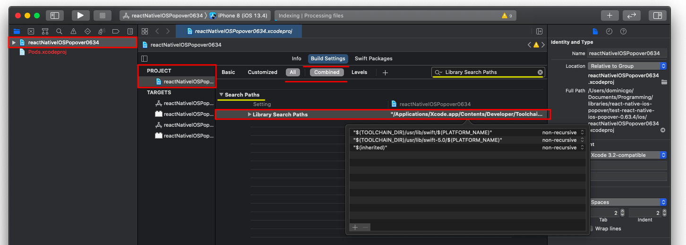

<br>

1. Open your `ios/project.xcworkspace` project.
2. In the project navigator panel (located on the right side of Xcode), select your project group (i.e. the item with the blueprint icon).
3. The Xcode project editor should appear. In the left panel, under the "Project" section, select your project (if it isn't already selected).
4. In the project section's top tab bar, select the "Build Settings" tab (also make sure the "All" and "Combined" tabs are selected).
5. In the project navigator list, under the "Search Path" section, there should be a "Library Search Paths" setting (alternatively, you can search for "Library Search Paths" in the search bar).
6.  According to this [issue comment](https://github.com/facebook/react-native/issues/29246#issuecomment-667518920), you can clear all the items listed in the "Library Search Paths" setting by selecting the items in the list, and pressing the "-" button in the popover. 
	* **TLDR**: Xcode automatically manages this setting, and the RN template hardcodes it to use Swift 5.0.
	* Alternatively, you can change the entry `"$(TOOLCHAIN_DIR)/usr/lib/swift-5.0/$(PLATFORM_NAME)"` to `"$(TOOLCHAIN_DIR)/usr/lib/swift-5.3/$(PLATFORM_NAME)"` i.e. change `swift-5.0` to `swift-5.3`, or whatever the newest version of swift that comes with your Xcode installation (to show the popup dialog, double click the value/item).
7. If you haven't already, make sure to create an empty swift file. Then clean the build folder (the option is in the menu bar under: "Product" -> "Clean Build Folder") and try building your project again.
8. If you are still having problems building the app, try the following and build your project again:
  * Try clearing out Xcode's `derivedData` directory: `rm -rf ~/Library/Developer/Xcode/DerivedData/*` (check out this [gist](https://gist.github.com/maciekish/66b6deaa7bc979d0a16c50784e16d697) for instructions on how to clean up Xcode)
  * Try clearing out the `Cocoapods` cache: `rm -rf "${HOME}/Library/Caches/CocoaPods"` (and then try running `pod install` again).

<br>


<br>

**Explanation**: Some versions of the react-native template hard codes the swift library search paths to use swift `5.0` (which causes the linker to mismatch the swift system libraries bundled with your Xcode + iOS/Simulator installation).

Here are some related issues in the RN repo: [Issue 30202](https://github.com/facebook/react-native/pull/30202) and [Issue 29178](https://github.com/facebook/react-native/pull/29178). 

<br><br>

## C. Basic Usage

For more examples, check out the [Usage And Examples](#e-usage-and-examples) section.

<br>

[🔗 Full Example](example/src/examples/BasicUsageExample01.tsx)

```jsx
import * as React from 'react';
import { StyleSheet, Text } from 'react-native';

import { ContextMenuView } from 'react-native-ios-context-menu';

export function BasicUsageExample01() {
  return (
    <ContextMenuView
      style={styles.container}
      menuConfig={{
        menuTitle: 'BasicUsageExample01',
        menuItems: [{
          actionKey  : 'key-01',
          actionTitle: 'Action #1',
        }, {
          actionKey  : 'key-02'   ,
          actionTitle: 'Action #2',
        }, {
          actionKey  : 'key-03'   ,
          actionTitle: 'Action #3',
        }],
      }}
    >
      <Text style={styles.text}>
        Press And Hold To Show Context Menu
      </Text>
    </ContextMenuView>
  );
};

const styles = StyleSheet.create({
  container: {
    margin: 10,
    padding: 10,
  },
  text: {
    fontSize: 16,
  },
});
```

<br><br>

## D. Documentation

💡 **Tip**: Most of the time, when a type or component is mentioned, you can click it to jump to that item in the README (or its declaration in the source code).

<br>

### D.1. Components

#### `ContextMenuView` Component

##### `ContextMenuView` Component: Props

| Prop Name and Type                                           | Description                                                  |
| :----------------------------------------------------------- | :----------------------------------------------------------- |
| ⚛️ `ViewProps`                                                | This component supports all the standard props from a `<View/>` component. |
| 🔤  `menuConfig`<br/><br/>⚛️ [`MenuConfig`](PLACE_HOLDER_LINK) | TBA                                                          |
| 🔤  `previewConfig`<br/><br/>⚛️ [`MenuPreviewConfig`](PLACE_HOLDER_LINK) | TBA                                                          |
| 🔤  `shouldUseDiscoverabilityTitleAsFallbackValueForSubtitle`<br/><br/>⚛️ [`abc`](PLACE_HOLDER_LINK)<br/><br/>✳️ **Default**: `true` | TBA                                                          |
| 🔤  `isContextMenuEnabled`<br/><br/>⚛️ [`abc`](PLACE_HOLDER_LINK)<br/><br/>✳️ **Default**: `true` | TBA                                                          |
| 🔤  `lazyPreview`<br/><br/>⚛️ `boolean`<br><br>✳️ **Default**: `true` | TBA                                                          |
| 🔤  `useActionSheetFallback`<br/><br/>⚛️ `boolean`<br/><br/>✳️ **Default**: `true` | TBA                                                          |
| 🔤  `renderPreview`<br/><br/>⚛️ [`abc`](PLACE_HOLDER_LINK)     | TBA                                                          |

<br>

##### `ContextMenuView` Component: Event Props

| Prop Name and Type                             | Description |
| :--------------------------------------------- | :---------- |
| 🔤  `abc`<br/><br/>⚛️ [`abc`](PLACE_HOLDER_LINK) | TBA         |

<br>

##### `ContextMenuView` Component: Properties/Methods

| Prop Name and Type                             | Description |
| :--------------------------------------------- | :---------- |
| 🔤  `abc`<br/><br/>⚛️ [`abc`](PLACE_HOLDER_LINK) | TBA         |

<br>

#### `ContextMenuButton` Component

##### `ContextMenuButton` Component: Props

| Prop Name and Type                                          | Description                                                  |
| :---------------------------------------------------------- | :----------------------------------------------------------- |
| ⚛️ `ViewProps`                                               | This component supports all the standard props from a `<View/>` component. |
| 🔤 **Required**: `abc`<br/><br/>⚛️ [`abc`](PLACE_HOLDER_LINK) | TBA                                                          |
| 🔤  `abc`<br/><br/>⚛️ [`abc`](PLACE_HOLDER_LINK)              | TBA                                                          |

<br>

##### `ContextMenuButton` Component: Event Props

| Prop Name and Type                             | Description |
| :--------------------------------------------- | :---------- |
| 🔤  `abc`<br/><br/>⚛️ [`abc`](PLACE_HOLDER_LINK) | TBA         |

<br>

##### `ContextMenuButton` Component: Properties/Methods

| Prop Name and Type                             | Description |
| :--------------------------------------------- | :---------- |
| 🔤  `abc`<br/><br/>⚛️ [`abc`](PLACE_HOLDER_LINK) | TBA         |

<br>

### D.2. Context

TBA

<br>

### D.3. Hooks

TBA

<br>

### D.4. Objects and Types

#### 📄 `MenuConfig.ts`

* 📌 **Declaration**: [`MenuConfig.ts`](src/types/MenuConfig.ts)

##### Object Type: `MenuConfig`

| Name and Type                                  | Description |
| :--------------------------------------------- | :---------- |
| 🔤  `abc`<br/><br/>⚛️ [`abc`](PLACE_HOLDER_LINK) | TBA         |

<br>

##### Object Type: `MenuActionConfig`

| Name and Type                                  | Description |
| :--------------------------------------------- | :---------- |
| 🔤  `abc`<br/><br/>⚛️ [`abc`](PLACE_HOLDER_LINK) | TBA         |

<br>

##### String Union: `MenuAttributes`

| Type     | Description |
| :------- | :---------- |
| 🔤  `abc` | TBA         |

<br>

##### String Union: `MenuState`

| Type                                           | Description |
| :--------------------------------------------- | :---------- |
| 🔤  `abc`<br/><br/>⚛️ [`abc`](PLACE_HOLDER_LINK) | TBA         |

<br>

##### String Union: `UIMenuOptions`

| Type                                           | Description |
| :--------------------------------------------- | :---------- |
| 🔤  `abc`<br/><br/>⚛️ [`abc`](PLACE_HOLDER_LINK) | TBA         |

<br>

##### String Union: `abc`

| Type                                           | Description |
| :--------------------------------------------- | :---------- |
| 🔤  `abc`<br/><br/>⚛️ [`abc`](PLACE_HOLDER_LINK) | TBA         |

<br>

#### 📄 `MenuPreviewConfig.ts`

* 📌 **Declaration**: [`MenuPreviewConfig.ts`](src/types/MenuPreviewConfig.ts)

##### Object Type: `MenuPreviewConfig`

| Name and Type                                  | Description |
| :--------------------------------------------- | :---------- |
| 🔤  `abc`<br/><br/>⚛️ [`abc`](PLACE_HOLDER_LINK) | TBA         |

<br>

##### String Union: `ContextMenuInteractionCommitStyle`

| Name and Type                                  | Description |
| :--------------------------------------------- | :---------- |
| 🔤  `abc`<br/><br/>⚛️ [`abc`](PLACE_HOLDER_LINK) | TBA         |

<br>

##### String Union: `MenuPreviewSize`

| Name and Type                                  | Description |
| :--------------------------------------------- | :---------- |
| 🔤  `abc`<br/><br/>⚛️ [`abc`](PLACE_HOLDER_LINK) | TBA         |

<br>

##### String Union: `MenuPreviewType`

| Name and Type                                  | Description |
| :--------------------------------------------- | :---------- |
| 🔤  `abc`<br/><br/>⚛️ [`abc`](PLACE_HOLDER_LINK) | TBA         |

<br>

#### 📄 `MenuIconConfig.ts`

* 📌 **Declaration**: [`MenuIconConfig.ts`](src/types/MenuIconConfig.ts)

<br>

##### Object Type: `IconConfig`

This has been deprecated and will be removed in a future version. Use [`ImageItemConfig`](PLACE_HOLDER_LINK) instead.

| Name and Type                                  | Description |
| :--------------------------------------------- | :---------- |
| 🔤  `abc`<br/><br/>⚛️ [`abc`](PLACE_HOLDER_LINK) | TBA         |

<br>

#### 📄 `ImageItemConfig.ts`

* 📌 **Declaration**: [`ImageItemConfig.ts`](src/types/ImageItemConfig.ts)

<br>

##### Object Type: `ImageItemConfig`

This type is an object tagged union type, with the `type` property being the tag that separates the unions. The table below defines the possible valid values that can be assigned to the `type` property.

| Name and Type                                                | Description |
| :----------------------------------------------------------- | ----------- |
| 🔤  **Required**: `type`<br/><br/>⚛️  `ImageItemConfigType` string union, i.e. `'IMAGE_ASSET' ¦ 'IMAGE_SYSTEM' ¦ 'IMAGE_REQUIRE' ¦ 'IMAGE_EMPTY' ¦ 'IMAGE_RECT' ¦ 'IMAGE_GRADIENT' ` | TBA         |

<br>

###### `ImageItemConfig`: `IMAGE_ASSET`

| Name and Type                                                | Description                                                  |
| :----------------------------------------------------------- | ------------------------------------------------------------ |
| 🔤  **Required**: `type`<br/><br/>⚛️  `string` i.e. `'IMAGE_ASSET' ` | TBA<br/><br/>📌 Maps to [`UIImage.init(named:)`](https://developer.apple.com/documentation/uikit/uiimage/1624146-init) constructor in the apple docs. |
| 🔤  **Required**: `imageValue`<br/><br/>⚛️  `string`           | TBA                                                          |
| 🔤  `imageOptions?`<br/><br/>⚛️  [`UIImageConfig`](PLACE_HOLDER_LINK) | TBA                                                          |

<br>

###### `ImageItemConfig`: `IMAGE_SYSTEM`

| Name and Type                                                | Description                                                  |
| :----------------------------------------------------------- | ------------------------------------------------------------ |
| 🔤  **Required**: `type`<br/><br/>⚛️  `string` i.e. `'IMAGE_SYSTEM' ` | TBA<br/><br/>📌 Maps to [`UIImage.init(systemName:withConfiguration:)`](https://developer.apple.com/documentation/uikit/uiimage/3294234-init) constructor in the apple docs. |
| 🔤  **Required**:  `imageValue`<br/><br/>⚛️  [`ImageSystemConfig`](PLACE_HOLDER_LINK) | TBA<br/><br/>📌 Maps to the `withConfiguration` argument label in the  [`UIImage.init(systemName:withConfiguration:)`](https://developer.apple.com/documentation/uikit/uiimage/3294234-init) constructor in the apple docs. |
| 🔤  `imageOptions?`<br/><br/>⚛️  [`UIImageConfig`](PLACE_HOLDER_LINK) | TBA                                                          |

<br>

###### `ImageItemConfig`: `IMAGE_EMPTY`

| Name and Type                                                | Description |
| :----------------------------------------------------------- | ----------- |
| 🔤  **Required**: `type`<br/><br/>⚛️  `string` i.e. `'IMAGE_EMPTY' ` | TBA         |

<br>

###### `ImageItemConfig`: `IMAGE_RECT`

| Name and Type                                                | Description                                                  |
| :----------------------------------------------------------- | ------------------------------------------------------------ |
| 🔤  **Required**: `type`<br/><br/>⚛️  `string` i.e. `'IMAGE_RECT' ` | TBA<br/><br/>📝 **Note**: Programmatically creates an image using [`UIGraphicsImageRenderer`](https://developer.apple.com/documentation/uikit/uigraphicsrenderer). |
| 🔤  **Required**: `imageValue`<br/><br/>⚛️  [`ImageRectConfig`](PLACE_HOLDER_LINK) | TBA                                                          |

<br>

###### `ImageItemConfig`: `IMAGE_GRADIENT`

| Name and Type                                                | Description                                                  |
| :----------------------------------------------------------- | ------------------------------------------------------------ |
| 🔤  **Required**: `type`<br/><br/>⚛️  `string` i.e. `'IMAGE_GRADIENT' ` | TBA<br/><br/>📝 **Note**: Programmatically creates an image using [`UIGraphicsImageRenderer`](https://developer.apple.com/documentation/uikit/uigraphicsrenderer). |
| 🔤  `imageValue`<br/><br/>⚛️  [`ImageGradientConfig`](PLACE_HOLDER_LINK) | TBA                                                          |

<br>

#####  Object Type: `ImageResolvedAssetSource`

TBA

| Name and Type                    | Description |
| :------------------------------- | ----------- |
| 🔤  `height`<br/><br/>⚛️  `number` | TBA         |
| 🔤  `width`<br/><br/>⚛️  `number`  | TBA         |
| 🔤  `scale`<br/><br/>⚛️  `number`  | TBA         |
| 🔤  `uri`<br/><br/>⚛️  `string`    | TBA         |

<br>

#####  Object Type: `ImageRectConfig`

TBA

| Name and Type                                    | Description |
| :----------------------------------------------- | ----------- |
| 🔤 **Required**:  `width`<br/><br/>⚛️  `number`    | TBA         |
| 🔤 **Required**: `height`<br/><br/>⚛️  `number`    | TBA         |
| 🔤 **Required**: `fillColor`<br/><br/>⚛️  `string` | TBA         |
| 🔤  `borderRadius?`<br/><br/>⚛️  `number`          | TBA         |

<br>

#####  Object Type: `ImageGradientConfig`

TBA

| Name and Type                                                | Description                                                  |
| :----------------------------------------------------------- | ------------------------------------------------------------ |
| 🔤 **Required**:  `width`<br/><br/>⚛️  `number`                | TBA                                                          |
| 🔤 **Required**: `height`<br/><br/>⚛️  `number`                | TBA                                                          |
| 🔤  `borderRadius?`<br/><br/>⚛️  `number`                      | TBA                                                          |
| 🔤  **Required**:  `colors`<br/><br/>⚛️  `Array<string>`       | TBA<br/><br/>📌 Maps to [`CAGradientLayer.colors`](https://developer.apple.com/documentation/quartzcore/cagradientlayer/1462403-colors) property in the apple docs. |
| 🔤  `locations?`<br/><br/>⚛️  `Array<number>`                  | TBA<br/><br/>📌 Maps to [`CAGradientLayer.locations`](https://developer.apple.com/documentation/quartzcore/cagradientlayer/1462410-locations) property in the apple docs. |
| 🔤  `startPoint?`<br/><br/>⚛️  `Point ¦ PointPreset`<br><br>📌 [`Point`](PLACE_HOLDER_LINK)<br>📌 [`PointPreset`](PLACE_HOLDER_LINK) | TBA<br/><br/>📌 Maps to [`CAGradientLayer.startPoint`](https://developer.apple.com/documentation/quartzcore/cagradientlayer/1462408-startpoint) property in the apple docs. |
| 🔤  `endPoint?`<br/><br/>⚛️  `Point ¦ PointPreset`<br>📌 [`Point`](PLACE_HOLDER_LINK)<br/>📌 [`PointPreset`](PLACE_HOLDER_LINK) | TBA<br/><br/>📌 Maps to [`CAGradientLayer.endPoint`](https://developer.apple.com/documentation/quartzcore/cagradientlayer/1462412-endpoint) property in the apple docs. |
| 🔤  `type?`<br/><br/>⚛️  `string` i.e. `'axial' ¦ 'conic' ¦ 'radial'` | TBA<br/><br/>📌 Maps to [`CAGradientLayer.type`](https://developer.apple.com/documentation/quartzcore/cagradientlayer/1462413-type) property in the apple docs. |

<br>

#####  Object Type: `ImageSystemConfig`

TBA

| Name and Type                                                | Description                                                  |
| :----------------------------------------------------------- | ------------------------------------------------------------ |
| 🔤 **Required**:  `systemName`<br/><br/>⚛️  `string`           | TBA<br/><br/>📌 Maps to the `systemName` argument label in the [`UIImage.init(systemName:withConfiguration:)`](https://developer.apple.com/documentation/uikit/uiimage/3294234-init) constructor in the apple docs. |
| 🔤 `pointSize?`<br/><br/>⚛️  `number`                          | TBA<br/><br/>📌 Maps to [`UIImage.SymbolConfiguration.init(pointSize:)`](https://developer.apple.com/documentation/uikit/uiimage/symbolconfiguration/3294241-init) constructor in the apple docs. |
| 🔤  `weight?`<br/><br/>⚛️  [`ImageSymbolWeight`](PLACE_HOLDER_LINK) | TBA<br/><br/>📌 Maps to [`UIImage.SymbolConfiguration.init(weight:)`](https://developer.apple.com/documentation/uikit/uiimage/symbolconfiguration/3294247-init) constructor in the apple docs. |
| 🔤  `scale?`<br/><br/>⚛️  [`ImageSymbolScale`](PLACE_HOLDER_LINK) | TBA<br/><br/>📌 Maps to [`UIImage.SymbolConfiguration.init(scale:)`](https://developer.apple.com/documentation/uikit/uiimage/symbolconfiguration/3294244-init) constructor in the apple docs. |
| 🔤  `hierarchicalColor?`<br/><br/>⚛️  `Array<string>`          | TBA<br/><br/>📝 **Note A**: Cannot be used at the same time with `paletteColors`  (it's either one or the other).<br><br>📝 **Note B**: Requires iOS 15+.<br/><br/>📌 Maps to [`UIImage.SymbolConfiguration.init(hierarchicalColor:)`](https://developer.apple.com/documentation/uikit/uiimage/symbolconfiguration/3810053-init) constructor in the apple docs. |
| 🔤  `paletteColors?`<br/><br/>⚛️  `string`                     | TBA<br/><br/>📝 **Note A**: Cannot be used at the same time with `hierarchicalColor`  (it's either one or the other).<br/><br/>📝 **Note B**: Requires iOS 15+.<br/><br/>📌 Maps to [`UIImage.SymbolConfiguration.init(paletteColors:)`](https://developer.apple.com/documentation/uikit/uiimage/symbolconfiguration/3810054-init) constructor in the apple docs. |

<br>

#### Undocumented Types

TBA

| Type                                                        | Description                                                  |
| :---------------------------------------------------------- | ------------------------------------------------------------ |
| 📌 **Declaration**: [`MenuEvents`](src/types/MenuEvents.ts)  | This file contains all the menu-related events and event objects. |
| 📌 **Declaration**: [`MiscTypes.ts`](src/types/MiscTypes.ts) | This file contains a bunch of types that haven't been categorized yet.<br><br>Contains: `PointPreset`, `Point`, `DynamicColor`, etc. |

<br>

### D.5. Constants

TBA

<br><br>

## E. Usage And Examples

### `ContextMenuView` Example 01

A basic context menu that has 3 menu action items (e.g. "Action #1", "Action #2", and "Action #3").

* The `ContextMenuView.menuConfig` prop accepts an optional `MenuConfig` object.

	* You can set the context menu title via the `MenuConfig.menuTitle` property.
	* To populate the context menu with items, you can pass a `MenuActionConfig` object to the `MenuConfig.menuItems` property.
	* A `MenuActionConfig` object represents an action item in the context menu (e.g. copy, paste, delete, etc).
		* The `MenuActionConfig.actionKey` property serves as a unique identifier for your menu action.
			* You will receive the value you passed in `MenuActionConfig.actionKey` in the `ContextMenuView.onPressMenuItem` event (i.e. via the  `nativeEvent` object).
			* In other words, the `actionKey` allows you to identify which menu action item was selected/pressed.
			* 📝 **Note**: Make sure that the `actionKey` is unique for each instance of the `ContextMenuView` component.

	

*  You can use the `ContextMenuView.onPressMenuItem` event prop to get notified whenever a menu action item has been selected.
	* The function you pass to the `onPressMenuItem` prop receives a `OnPressMenuItemEventObject` object.
	* Details about the selected menu action item can be accessed via the `OnPressMenuItemEventObject.nativeEvent` object.
		* E.g. `OnPressMenuItemEventObject.nativeEvent.actionKey`.

<br>

[🔗 Full Example](example/src/examples/ContextMenuViewExample01.tsx)

```jsx
// 📝 Note: for the sake of brevity, some of the code is omitted...
import { ContextMenuView } from 'react-native-ios-context-menu';

export function ContextMenuViewExample01(props) {
  return (
    <ContextMenuView
      menuConfig={{
        menuTitle: 'ContextMenuViewExample01',
        menuItems: [{
          actionKey  : 'key-01',
          actionTitle: 'Action #1',
        }, {
          actionKey  : 'key-02'   ,
          actionTitle: 'Action #2',
        }, {
          actionKey  : 'key-03'   ,
          actionTitle: 'Action #3',
        }],
      }}
      onPressMenuItem={({nativeEvent}) => {
        Alert.alert(
          'onPressMenuItem Event',
          `actionKey: ${nativeEvent.actionKey} - actionTitle: ${nativeEvent.actionTitle}`
        );
      }}
    >
      {/** Components */}
    </ContextMenuView>
  );
};
```

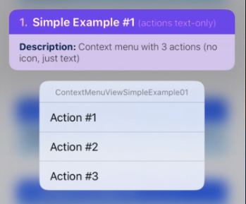

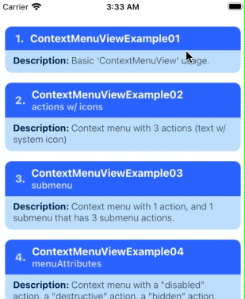

<br>

### `ContextMenuView` Example 02

A basic context menu that has 3 menu action items, each with a different "SF Symbols" icon.

* A `MenuActionConfig` object can be configured to show an icon via the `MenuActionConfig.icon` property.

	* The `icon` property accepts a `ImageItemConfig` object.
		* A `ImageItemConfig` object is used to describe images/assets (e.g. SF Symbols icons, images, xcasset images, programmatic images, etc).

	

	* In this example, we want to use a "SF Symbols" icon for the menu action. 

		* In order to do this, the `ImageItemConfig.type` property must be set to `"IMAGE_SYSTEM"`.

			* Passing in a value of `"IMAGE_SYSTEM"` to the `type` property means that we want to create a "SF Symbols" system icon.
			* Using a "SF Symbols" icon requires iOS 13+.

			

		* In order to configure what kind of "SF Symbols" icon we want to use for the menu action, we need to pass in a `ImageSystemConfig` object to the  `ImageItemConfig.imageValue` property.

			* We set what kind of icon to use via passing a string value to the `ImageSystemConfig.systemName` property.
			* The string value passed to the `systemName` property must be a valid SF Symbols name.
				* To view the list of SF Symbols icons (along with their corresponding icon names), you'll need to download the SF Symbols Mac app from [this page](https://developer.apple.com/design/human-interface-guidelines/sf-symbols/overview/).

<br>

[🔗 Full Example](example/src/examples/ContextMenuViewExample02.tsx)

```jsx
// 📝 Note: for the sake of brevity, some of the code is omitted...
import { ContextMenuView } from 'react-native-ios-context-menu';

export function ContextMenuViewExample02(props) {
  return (
    <ContextMenuView
      menuConfig={{
          menuTitle: 'ContextMenuViewExample02',
          menuItems: [{
            actionKey  : 'key-01',
            actionTitle: 'Action #1',
            icon: {
              type: 'IMAGE_SYSTEM',
              imageValue: {
                systemName: 'folder',
              },
            }
          }, {
            actionKey  : 'key-02'   ,
            actionTitle: 'Action #2',
            icon: {
              type: 'IMAGE_SYSTEM',
              imageValue: {
                systemName: 'dial.fill',
              },
            }
          }, {
            actionKey  : 'key-03'   ,
            actionTitle: 'Action #3',
            icon: {
              type: 'IMAGE_SYSTEM',
              imageValue: {
                systemName: 'archivebox.fill',
              },
            }
          }],
        }}
    >
      {/** Components */}
    </ContextMenuView>
  );
};
```


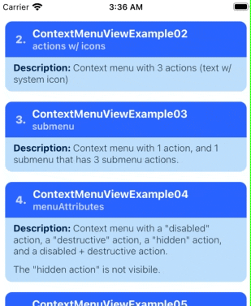

<br>

### `ContextMenuView` Example 03

This example shows a context menu that has a submenu item inside its list of menu actions.

* A context menu supports having nested menu's (i.e. submenu's).

	* A submenu is basically just another menu with it's own list separate list of menu actions.
	* Tapping/selecting a submenu will show another context menu,

	

* The `MenuConfig.menuItems` property can accept a `MenuActionConfig` object, or a `MenuConfig` object.

	* Passing in a `MenuActionConfig` object to `MenuConfig.menuItems`  makes a menu action, conversely passing in a  `MenuConfig` object will create a submenu item.
	* In other words, to make a submenu, you just need to pass a `MenuConfig` item in the `MenuConfig.menuItems` property.
		* 📝 **Note**: You can nest as many submenu's you want (but just remember that having more than 3 nested submenus is considered bad UX).

<br>

[🔗 Full Example](example/src/examples/ContextMenuViewExample03.tsx)

```jsx
 // 📝 Note: for the sake of brevity, some of the code is omitted...
import { ContextMenuView } from 'react-native-ios-context-menu';

export function ContextMenuViewExample03(props) {
  return (
    <ContextMenuView
      menuConfig={{
        menuTitle: 'ContextMenuViewExample03',
        menuItems: [{
          actionKey  : 'key-01',
          actionTitle: 'Action #1',
          icon: {
            type: 'IMAGE_SYSTEM',
            imageValue: {
              systemName: 'folder',
            },
          }
        }, {
          menuTitle: 'Submenu...',
          menuItems: [{
            actionKey  : 'key-01-01',
            actionTitle: 'Submenu Action #1',
            icon: {
              type: 'IMAGE_SYSTEM',
              imageValue: {
                systemName: 'star',
              },
            }
          }, {
            actionKey  : 'key-01-02',
            actionTitle: 'Submenu Action #2',
            icon: {
              type: 'IMAGE_SYSTEM',
              imageValue: {
                systemName: 'star.lefthalf.fill',
              },
            }
          }, {
            actionKey  : 'key-01-03',
            actionTitle: 'Submenu Action #3',
            icon: {
              type: 'IMAGE_SYSTEM',
              imageValue: {
                systemName: 'star.fill',
              },
            }
          }]
        }],
      }}
    >
      {/** Components */}
    </ContextMenuView>
  );
};
```

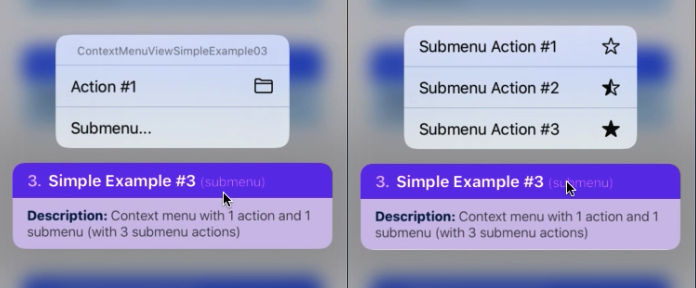

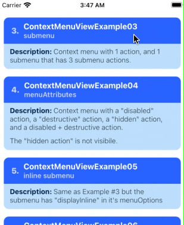

<br>

### `ContextMenuView` Example 04

This example context menu showcases the `MenuActionConfig.menuAttributes` property.

* The `MenuActionConfig.menuAttributes` property accepts an array of string (i.e. an array of `MenuAttributes` items),

* This submenu has 3 actions:
	* The first menu action is a "disabled" action. It has it's `menuAttributes` set to `[disabled]`.
		* The action title text and icon becomes grey out.
	* The second menu action is a destructive action. It has it's `menuAttributes` set to `[destructive]`.
		* The action title text and icon becomes red.
	* The third menu action is a "hidden" action. It has it's `menuAttributes` set to `[hidden]`.
		* The menu action is not visible in the menu's list of actions. This is useful for temporarily hiding a menu action item.
	* The fourth menu action is a "disabled" + "destructive"  action. Visually, it looks very similar to the `disabled` action. 

[🔗 Full Example](example/src/examples/ContextMenuViewExample04.tsx)

```jsx
 // 📝 Note: for the sake of brevity, some of the code is omitted...
import { ContextMenuView } from 'react-native-ios-context-menu';

export function ContextMenuViewExample04(props) {
  return (
    <ContextMenuView
      menuConfig={{
        menuTitle: 'ContextMenuViewExample04',
        menuItems: [{
          actionKey     : 'key-01',
          actionTitle   : 'Disabled Action',
          menuAttributes: ['disabled'],
          icon: {
            type: 'IMAGE_SYSTEM',
            imageValue: {
              systemName: 'folder',
            },
          }
        }, {
          actionKey     : 'key-02'   ,
          actionTitle   : 'Destructive Action',
          menuAttributes: ['destructive'],
          icon: {
            type: 'IMAGE_SYSTEM',
            imageValue: {
              systemName: 'trash',
            },
          }
        }, {
          actionKey     : 'key-03'   ,
          actionTitle   : 'Hidden Action',
          menuAttributes: ['hidden'],
          icon: {
            type: 'IMAGE_SYSTEM',
            imageValue: {
              systemName: 'trash',
            },
          }
        }, {
          actionKey     : 'key-04'   ,
          actionTitle   : 'Disabled/Destructive',
          menuAttributes: ['disabled', 'destructive'],
          icon: {
            type: 'IMAGE_SYSTEM',
            imageValue: {
              systemName: 'trash.fill',
            },
          }
        }],
      }}
    >
      {/** Components */}
    </ContextMenuView>
  );
};
```


<br>

### `ContextMenuView` Example 05

[🔗 Full Example](example/src/examples/ContextMenuViewExample05.tsx)

```jsx
 // 📝 Note: for the sake of brevity, some of the code is omitted...
import { ContextMenuView } from 'react-native-ios-context-menu';

export function ContextMenuViewExample05(props) {
  return (
    <ContextMenuView
      menuConfig={{
        menuTitle: 'ContextMenuViewExample04',
        menuItems: [{
          actionKey     : 'key-01',
          actionTitle   : 'Disabled Action',
          menuAttributes: ['disabled'],
          icon: {
            type: 'IMAGE_SYSTEM',
            imageValue: {
              systemName: 'folder',
            },
          }
        }, {
          actionKey     : 'key-02'   ,
          actionTitle   : 'Destructive Action',
          menuAttributes: ['destructive'],
          icon: {
            type: 'IMAGE_SYSTEM',
            imageValue: {
              systemName: 'trash',
            },
          }
        }, {
          actionKey     : 'key-03'   ,
          actionTitle   : 'Hidden Action',
          menuAttributes: ['hidden'],
          icon: {
            type: 'IMAGE_SYSTEM',
            imageValue: {
              systemName: 'trash',
            },
          }
        }, {
          actionKey     : 'key-04'   ,
          actionTitle   : 'Disabled/Destructive',
          menuAttributes: ['disabled', 'destructive'],
          icon: {
            type: 'IMAGE_SYSTEM',
            imageValue: {
              systemName: 'trash.fill',
            },
          }
        }],
      }}
    >
      {/** Components */}
    </ContextMenuView>
  );
};
```


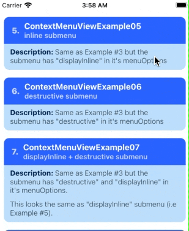

<br>

### `ContextMenuView` Example 06

[🔗 Full Example](example/src/examples/ContextMenuViewExample06.tsx)

```jsx
 // 📝 Note: for the sake of brevity, some of the code is omitted...
import { ContextMenuView } from 'react-native-ios-context-menu';

export function ContextMenuViewExample06(props) {
  return (
    <ContextMenuView
      menuConfig={{
        menuTitle: 'ContextMenuViewExample06',
        menuItems: [{
          actionKey  : 'key-01',
          actionTitle: 'Action #1',
          icon: {
            type: 'IMAGE_SYSTEM',
            imageValue: {
              systemName: 'folder',
            },
          }
        }, {
          menuTitle: 'Submenu...',
          menuOptions: ['destructive'],
          menuItems: [{
            actionKey  : 'key-01-01',
            actionTitle: 'Submenu Action #1',
            icon: {
              type: 'IMAGE_SYSTEM',
              imageValue: {
                systemName: 'star',
              },
            }
          }, {
            actionKey  : 'key-01-02',
            actionTitle: 'Submenu Action #2',
            icon: {
              type: 'IMAGE_SYSTEM',
              imageValue: {
                systemName: 'star.lefthalf.fill',
              },
            }
          }, {
            actionKey  : 'key-01-03',
            actionTitle: 'Submenu Action #3',
            icon: {
              type: 'IMAGE_SYSTEM',
              imageValue: {
                systemName: 'star.fill',
              },
            }
          }]
        }],
      }}
    >
      {/** Components */}
    </ContextMenuView>
  );
};
```


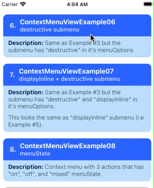

<br>

### `ContextMenuView` Example 07

[🔗 Full Example](example/src/examples/ContextMenuViewExample07.tsx)

```jsx
 // 📝 Note: for the sake of brevity, some of the code is omitted...
import { ContextMenuView } from 'react-native-ios-context-menu';

export function ContextMenuViewExample07(props) {
  return (
    <ContextMenuView
      menuConfig={{
        menuTitle: 'ContextMenuViewExample07',
        menuItems: [{
          actionKey  : 'key-01',
          actionTitle: 'Action #1',
          icon: {
            type: 'IMAGE_SYSTEM',
            imageValue: {
              systemName: 'folder',
            },
          }
        }, {
          menuTitle: 'Submenu...',
          menuOptions: ['displayInline', 'destructive'],
          menuItems: [{
            actionKey  : 'key-01-01',
            actionTitle: 'Submenu Action #1',
            icon: {
              type: 'IMAGE_SYSTEM',
              imageValue: {
                systemName: 'star',
              },
            }
          }, {
            actionKey  : 'key-01-02',
            actionTitle: 'Submenu Action #2',
            icon: {
              type: 'IMAGE_SYSTEM',
              imageValue: {
                systemName: 'star.lefthalf.fill',
              },
            }
          }, {
            actionKey  : 'key-01-03',
            actionTitle: 'Submenu Action #3',
            icon: {
              type: 'IMAGE_SYSTEM',
              imageValue: {
                systemName: 'star.fill',
              },
            }
          }]
        }],
      }}
    >
      {/** Components */}
    </ContextMenuView>
  );
};
```


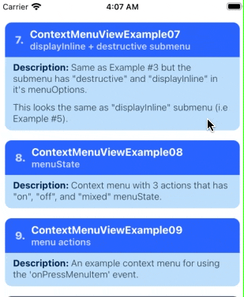

<br>

### `ContextMenuView` Example 08

[🔗 Full Example](example/src/examples/ContextMenuViewExample08.tsx)

```jsx
 // 📝 Note: for the sake of brevity, some of the code is omitted...
import { ContextMenuView } from 'react-native-ios-context-menu';

export function ContextMenuViewExample08(props) {
  return (
    <ContextMenuView
      menuConfig={{
        menuTitle: 'ContextMenuViewExample08',
        menuItems: [{
          actionKey  : 'key-01',
          actionTitle: 'menuState: on',
          menuState  : 'on',
          icon: {
            type: 'IMAGE_SYSTEM',
            imageValue: {
              systemName: 'folder',
            },
          }
        }, {
          actionKey  : 'key-02'   ,
          actionTitle: 'menuState: off',
          menuState  : 'off',
          icon: {
            type: 'IMAGE_SYSTEM',
            imageValue: {
              systemName: 'dial',
            },
          }
        }, {
          actionKey  : 'key-03'   ,
          actionTitle: 'menuState: mixed',
          menuState  : 'mixed',
          icon: {
            type: 'IMAGE_SYSTEM',
            imageValue: {
              systemName: 'archivebox',
            },
          }
        }],
      }}
    >
      {/** Components */}
    </ContextMenuView>
  );
};
```


<br>

### `ContextMenuView` Example 09

[🔗 Full Example](example/src/examples/ContextMenuViewExample09.tsx)

```jsx
 // 📝 Note: for the sake of brevity, some of the code is omitted...
import { ContextMenuView } from 'react-native-ios-context-menu';

export function ContextMenuViewExample09(props) {
  return (
    <ContextMenuView
      menuConfig={{
        menuTitle: 'ContextMenuViewExample09',
        menuItems: [{
          actionKey  : 'save',
          actionTitle: 'Save',
          icon: {
            type: 'IMAGE_SYSTEM',
            imageValue: {
              systemName: 'square.and.arrow.down',
            },
          }
        }, {
          actionKey  : 'like',
          actionTitle: 'Like',
          icon: {
            type: 'IMAGE_SYSTEM',
            imageValue: {
              systemName: 'hand.thumbsup',
            },
          }
        }, {
          actionKey  : 'play',
          actionTitle: 'Play',
          icon: {
            type: 'IMAGE_SYSTEM',
            imageValue: {
              systemName: 'play',
            },
          }
        }],
      }}
      onPressMenuItem={({nativeEvent}) => {
        switch (nativeEvent.actionKey) {
          case 'save':
            Alert.alert('saving...');
            break;

          case 'like':
            Alert.alert('liking...');
            break;

          case 'play':
            Alert.alert('playing...');
            break;
        };
      }}
    >
      {/** Components */}
    </ContextMenuView>
  );
};
```

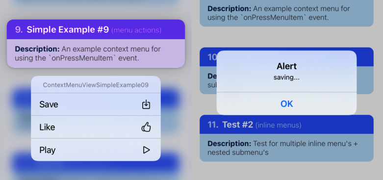

<br>

### `ContextMenuView` Example 10

[🔗 Full Example](example/src/examples/ContextMenuViewExample10.tsx)

```jsx
 // 📝 Note: for the sake of brevity, some of the code is omitted...
import { ContextMenuView } from 'react-native-ios-context-menu';

export function ContextMenuViewExample10(props) {
  const [timer, setTimer] = React.useState(0);
  const increment = React.useRef(null);

  const handleStart = () => {
    increment.current = setInterval(() => {
      setTimer((prevTimer) => prevTimer + 1);
    }, 1000);
  };

  const handleReset = () => {
    clearInterval(increment.current);
    setTimer(0);
  };

  return (
    <ContextMenuView
      onMenuDidShow={() => handleStart()}
      onMenuDidHide={() => handleReset()}
      menuConfig={{
        menuTitle: 'ContextMenuViewExample10',
        menuItems: [{
          actionKey  : 'key-00',
          actionTitle: `Static Action`,
          icon: {
            type: 'IMAGE_SYSTEM',
            imageValue: {
              systemName: 'square.and.arrow.down',
            },
          }
        }, {
          actionKey  : 'key-01',
          actionTitle: `timer: ${timer}`,
          icon: {
            type: 'IMAGE_SYSTEM',
            imageValue: {
              systemName: ((timer % 2 === 0)
                ? 'heart'
                : 'heart.fill'
              ),
            },
          }
        }, (timer % 3 === 0) && {
          actionKey  : 'key-02',
          actionTitle: `Dynamic Action`,
          icon: {
            type: 'IMAGE_SYSTEM',
            imageValue: {
              systemName: 'scissors.badge.ellipsis',
            },
          }
        }],
      }}
    >
      {/** Components */}
    </ContextMenuView>
  );
};
```


<br>

### `ContextMenuView` Example 11

[🔗 Full Example](example/src/examples/ContextMenuViewExampleXX.tsx)

```jsx
 // 📝 Note: for the sake of brevity, some of the code is omitted...
import { ContextMenuView } from 'react-native-ios-context-menu';

export function ContextMenuViewExample11(props) {
  return (
    <ContextMenuView
      previewConfig={{
        previewType: 'CUSTOM',
        previewSize: 'STRETCH',
        backgroundColor: 'white'
      }}
      renderPreview={() => (
        <View style={{ flex: 1, alignItems: 'center', justifyContent: 'center' }}>
          <Text style={{fontSize: 32}}>
            Hello World
          </Text>
          <Text style={{fontSize: 32}}>
            Hello World
          </Text>
          <Text style={{fontSize: 32}}>
            Hello World
          </Text>
        </View>
      )}
    >
      {/** Components */}
    </ContextMenuView>
  );
};
```


<br>

### `ContextMenuView` Example 12

[🔗 Full Example](example/src/examples/ContextMenuViewExample12.tsx)

```jsx
 // 📝 Note: for the sake of brevity, some of the code is omitted...
import { ContextMenuView } from 'react-native-ios-context-menu';

export function ContextMenuViewExample12(props) {
    const [timer, setTimer] = React.useState(0);
  const increment = React.useRef(null);

  const handleStart = () => {
    increment.current = setInterval(() => {
      setTimer((prevTimer) => prevTimer + 1);
    }, 1000);
  };

  const handleStop = () => {
    clearInterval(increment.current);
  };

  const handleReset = () => {
    clearInterval(increment.current);
    setTimer(0);
  };

  return (
    <ContextMenuView
      menuConfig={{
        menuTitle: 'ContextMenuViewExample12',
        menuItems: [{
          actionKey     : 'add',
          actionTitle   : `Add 100`,
          icon: {
            type: 'IMAGE_SYSTEM',
            imageValue: {
              systemName: 'plus',
            },
          }
        }, (timer > 0) && {
          actionKey     : 'reset',
          actionTitle   : `Reset Counter`,
          menuAttributes: ['destructive'],
          icon: {
            type: 'IMAGE_SYSTEM',
            imageValue: {
              systemName: 'trash',
            },
          }
        }],
      }}
      previewConfig={{
        previewType: 'CUSTOM',
        backgroundColor: 'white'
      }}
      renderPreview={() => (
        <View style={{ padding: 20 }}>
          <Text style={{fontSize: 32}}>
            {`Counter: ${timer}`}
          </Text>
          <Text style={{fontSize: 32}}>
            {(timer % 2 === 0)? 'EVEN' : 'The number is: ODD'}
          </Text>
        </View>
      )}
      onMenuDidShow={() => handleStart()}
      onMenuDidHide={() => handleStop()}
      onPressMenuItem={({nativeEvent}) => {
        switch (nativeEvent.actionKey) {
          case 'add':
            setTimer((prevTimer) => prevTimer + 100);
            break;

          case 'reset':
            handleReset();
            break;
        };
      }}
    >
      {/** Components */}
    </ContextMenuView>
  );
};
```


<br>

### `ContextMenuView` Example 13

[🔗 Full Example](example/src/examples/ContextMenuViewExample13.tsx)

```jsx
 // 📝 Note: for the sake of brevity, some of the code is omitted...
import { ContextMenuView } from 'react-native-ios-context-menu';

export function ContextMenuViewExample13(props) {
  return (
    <ContextMenuView
      menuConfig={{
        menuTitle: 'ContextMenuViewExample13',
        menuItems: [{
          actionKey           : 'key-01',
          actionTitle         : 'Action #1',
          discoverabilityTitle: 'Action subtitle',
        }, {
          actionKey           : 'key-02'   ,
          actionTitle         : 'Action #2',
          discoverabilityTitle: 'Lorum ipsum sit amit dolor aspicing',
        }, {
          actionKey           : 'key-03'   ,
          actionTitle         : 'Action #3',
          discoverabilityTitle: 'Very long `discoverabilityTitle` lorum ipsum sit amit',
        }],
      }}
    >
      {/** Components */}
    </ContextMenuView>
  );
};
```


<br>

### `ContextMenuView` Example 14

[🔗 Full Example](example/src/examples/ContextMenuViewExample14.tsx)

```jsx
 // 📝 Note: for the sake of brevity, some of the code is omitted...
import { ContextMenuView } from 'react-native-ios-context-menu';

export function ContextMenuViewExample14(props) {
  return (
    <ContextMenuView
      previewConfig={{
        previewType: 'CUSTOM',
        previewSize: 'STRETCH',
        backgroundColor: 'rgba(255,255,255,0.75)',
        preferredCommitStyle: 'pop',
      }}
      renderPreview={() => (
        <View style={{ flex: 1, alignItems: 'center', justifyContent: 'center' }}>
          <Text style={{fontSize: 32}}>
            Hello World
          </Text>
          <Text style={{fontSize: 32}}>
            Hello World
          </Text>
          <Text style={{fontSize: 32}}>
            Hello World
          </Text>
        </View>
      )}
    >
      {/** Components */}
    </ContextMenuView>
  );
};
```


<br>

### `ContextMenuView` Example 15

[🔗 Full Example](example/src/examples/ContextMenuViewExample15.tsx)

```jsx
 // 📝 Note: for the sake of brevity, some of the code is omitted...
import { ContextMenuView } from 'react-native-ios-context-menu';

export function ContextMenuViewExample15(props) {
  const [targetViewNode, setTargetViewNode] = React.useState(null);

  const viewRef = React.useRef();

  React.useEffect(() => {
    setTargetViewNode(
      findNodeHandle(viewRef.current)
    );
  }, []);

  return (
    <ContextMenuView
      menuConfig={{
        menuTitle: 'ContextMenuViewExample15',
        menuItems: [{
          actionKey  : 'key-01',
          actionTitle: 'Action #1',
        }],
      }}
      previewConfig={{
        targetViewNode: targetViewNode,
      }}
    >
      <View
        style={styles.targetContainer}
        ref={viewRef}
      >
        <Text style={styles.text}>
          {`Hello! Target Node: ${targetViewNode}`}
        </Text>
      </View>
    </ContextMenuView>
  );
};

const styles = StyleSheet.create({
  targetContainer: {
    backgroundColor: 'rgba(255,255,255,0.5)',
    alignSelf: 'flex-start',
    padding: 10,
    borderRadius: 10,
    marginTop: 10,
  },
  text: {
    fontSize: 16,
  }
});
```

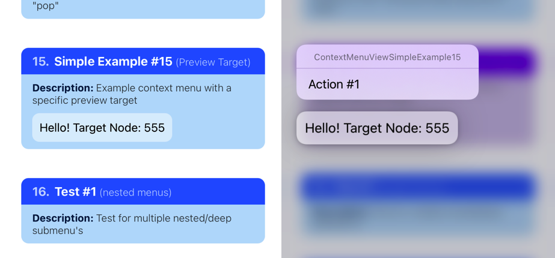

<br>

### `ContextMenuView` Example 16

[🔗 Full Example](example/src/examples/ContextMenuViewExample16.tsx)

```jsx
 // 📝 Note: for the sake of brevity, some of the code is omitted...
import { ContextMenuView } from 'react-native-ios-context-menu';

export function ContextMenuViewExample16(props) {
  return (
    <ContextMenuView
      menuConfig={{
        menuTitle: 'ContextMenuViewExample16',
        menuItems: [{
          actionKey  : 'key-01',
          actionTitle: 'Action #1',
          discoverabilityTitle: 'No Icon',
        }, {
          actionKey  : 'key-02'   ,
          actionTitle: 'Action #2',
          discoverabilityTitle: 'Use "IMAGE_SYSTEM" icon',
          icon: {
            type: 'IMAGE_SYSTEM',
            imageValue: {
              systemName: 'dial.fill',
            },
          }
        }, {
          actionKey  : 'key-03'   ,
          actionTitle: 'Action #3',
          discoverabilityTitle: 'Use "ASSET" icon',
          icon: {
            type: 'IMAGE_ASSET',
            imageValue: 'icon-rainbow-flag',
          }
        }],
      }}
    >
      {/** Components */}
    </ContextMenuView>
  );
};
```


<br>

### `ContextMenuView` Example 17

[🔗 Full Example](example/src/examples/ContextMenuViewExample17.tsx)

```jsx
 // 📝 Note: for the sake of brevity, some of the code is omitted...
import { ContextMenuView } from 'react-native-ios-context-menu';

export function ContextMenuViewExample17(props) {
  return (
    <ContextMenuView
      menuConfig={{
        menuTitle: 'ContextMenuViewExample17',
        menuItems: [{
          actionKey  : 'key-01',
          actionTitle: 'Action #1',
          discoverabilityTitle: 'Blue Icon',
          icon: {
            type: 'IMAGE_SYSTEM',
            imageValue: {
              systemName: 'cloud.heavyrain.fill',
            },
            imageOptions: {
              tint: 'blue',
            },
          },
        }, {
          actionKey  : 'key-02',
          actionTitle: 'Action #2',
          discoverabilityTitle: 'Orange Icon',
          icon: {
            type: 'IMAGE_SYSTEM',
            imageValue: {
              systemName: 'exclamationmark.triangle.fill',
            },
            imageOptions: {
              tint: 'rgb(218,165,32)',
            },
          },
        }, {
          actionKey  : 'key-03',
          actionTitle: 'Action #3',
          discoverabilityTitle: 'Pink Icon',
          icon: {
            type: 'IMAGE_SYSTEM',
            imageValue: {
              systemName: 'heart.fill',
            },
            imageOptions: {
              tint: '#FF1493',
            },
          },
        }, {
          actionKey  : 'key-04',
          actionTitle: 'Action #4',
          discoverabilityTitle: 'Green Icon',
          icon: {
            type: 'IMAGE_SYSTEM',
            imageValue: {
              systemName: 'bubble.right.fill',
            },
            imageOptions: {
              tint: 'rgba(124,252,0,0.5)',
            },
          },
        }]
      }}
    >
      {/** Components */}
    </ContextMenuView>
  );
};
```

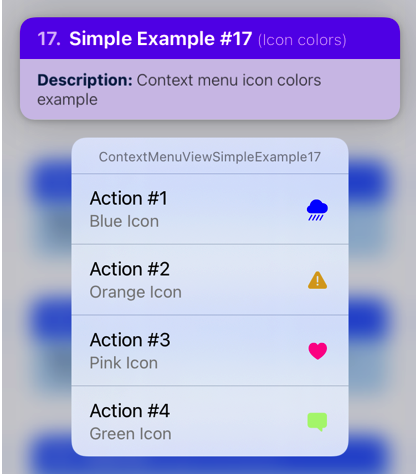

<br>

### `ContextMenuView` Example 18

[🔗 Full Example](example/src/examples/ContextMenuViewExample18.tsx)

```jsx
 // 📝 Note: for the sake of brevity, some of the code is omitted...
import { ContextMenuView } from 'react-native-ios-context-menu';

const iconA = Image.resolveAssetSource(
  require('../assets/emoji-pleading-face.png')
);

const iconB = Image.resolveAssetSource(
  require('../assets/emoji-smiling-face-with-hearts.png')
);

const iconC = Image.resolveAssetSource(
  require('../assets/emoji-sparkling-heart.png')
);

export function ContextMenuViewExample18(props) {
  return (
    <ContextMenuView
      style={props.style}
      menuConfig={{
        menuTitle: 'ContextMenuViewExample18',
        menuItems: [{
          actionKey  : 'key-01'   ,
          actionTitle: 'Action #1',
          discoverabilityTitle: 'Use "REQUIRE" icon',
          // `IconConfig` has been deprecated, please use 
          // `ImageItemConfig` instead (but it'll still work for now).
          // 
          // The other two menu actions in this example 
          // uses `ImageItemConfig` to set the menu action icons. 
          icon: {
            iconType: 'REQUIRE',
            iconValue: iconA,
          }
        }, {
          actionKey  : 'key-02'   ,
          actionTitle: 'Action #2',
          discoverabilityTitle: 'Use "IMAGE_REQUIRE" icon',
          icon: {
            type: 'IMAGE_REQUIRE',
            imageValue: iconB,
          }
        }, {
          actionKey  : 'key-03'   ,
          actionTitle: 'Action #3',
          discoverabilityTitle: 'Use "IMAGE_REQUIRE" icon',
          icon: {
            type: 'IMAGE_REQUIRE',
            imageValue: iconC,
          }
        }],
      }}
    >
      {/** Components */}
    </ContextMenuView>
  );
};
```


<br><br>

## F. Showcase, Tests and Demos

<br><br>

## G. Meta

<br><br>

## H. Licence